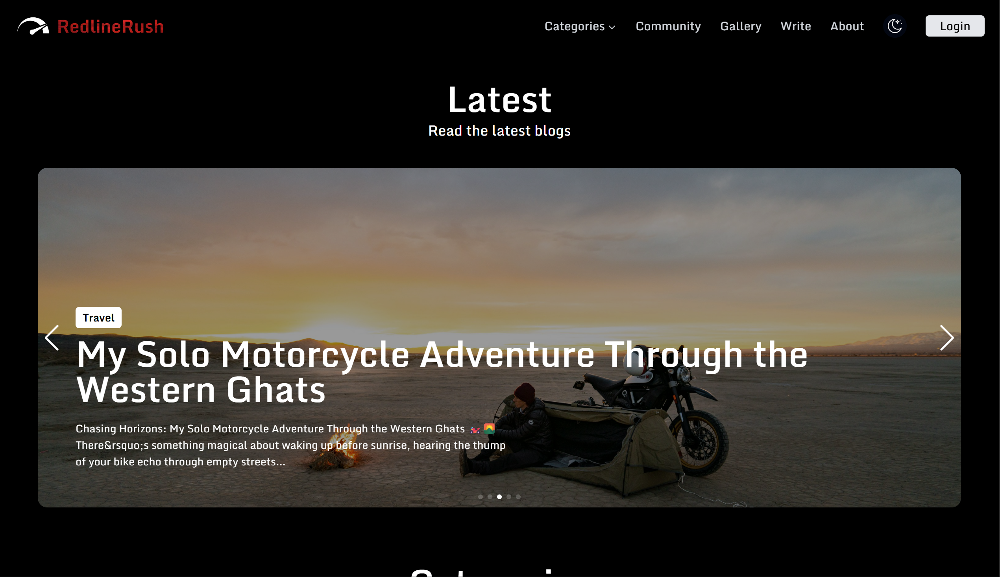
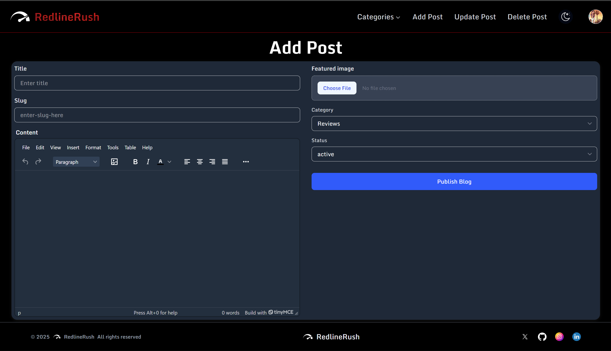

# 🏁 RedlineRush

> An automotive blog built for people who actually care about cars — with a UI to match.

Most car blogs look like they were designed in 2009. RedlineRush is different: a fast, visually sharp reading experience that treats automotive content with the same seriousness as the machines it covers.

**Live Demo → [redline-rush.vercel.app](https://redline-rush.vercel.app)**

---





---

## Features

**For Readers**

- Browse and read articles across automotive topics
- Clean, distraction-free reading experience
- Smooth animations and a UI that feels alive
- Create an account to save your spot in the community

**For Authors**

- Full rich-text editor (TinyMCE) with media support
- Create, edit, and publish posts from a dedicated author dashboard
- Role-based access — only authors can create content

**Under the Hood**

- Animated homepage with GSAP-powered transitions
- Swiper-based carousels for featured content
- Fully responsive across devices
- Auth-protected routes for both reader and author roles

---

## Tech Stack

| Layer               | Technology                  |
| ------------------- | --------------------------- |
| Frontend            | React 18, Vite              |
| Styling             | Tailwind CSS v4             |
| Animations          | GSAP + @gsap/react          |
| State Management    | Redux Toolkit + React Redux |
| Routing             | React Router DOM v7         |
| Backend / Auth / DB | Appwrite                    |
| Rich Text Editor    | TinyMCE                     |
| Forms               | React Hook Form             |
| Carousels           | Swiper                      |

---

## Getting Started

### Prerequisites

- Node.js 18+
- An [Appwrite](https://appwrite.io) project (cloud or self-hosted)

### Installation

```bash
git clone https://github.com/Vishesh-code-22/RedlineRush.git
cd RedlineRush
npm install
```

### Environment Variables

Create a `.env` file in the root directory:

```env
VITE_APPWRITE_URL=https://cloud.appwrite.io/v1
VITE_APPWRITE_PROJECT_ID=your_project_id
VITE_APPWRITE_DATABASE_ID=your_database_id
VITE_APPWRITE_COLLECTION_ID=your_collection_id
VITE_APPWRITE_BUCKET_ID=your_bucket_id
VITE_TINYMCE_API_KEY=your_tinymce_api_key
```

> The `.env` file is committed to this repo for reference — replace all values with your own before deploying.

### Run Locally

```bash
npm run dev
```

### Build for Production

```bash
npm run build
```

---

## Appwrite Setup

You'll need to configure the following in your Appwrite console:

1. **Authentication** — Enable Email/Password auth
2. **Database** — Create a database with a `posts` collection. Suggested attributes:
    - `title` (string)
    - `content` (string)
    - `slug` (string, unique)
    - `featuredImage` (string — file ID)
    - `status` (enum: `active`, `inactive`)
    - `userId` (string)
3. **Storage** — Create a bucket for featured images
4. **Permissions** — Set read permissions for published posts publicly; restrict write to authenticated authors

---

## Project Structure

```
src/
├── appwrite/        # Appwrite service wrappers (auth, database, storage)
├── components/      # Reusable UI components
├── pages/           # Route-level page components
├── store/           # Redux slices and store config
└── main.jsx         # App entry point
```

---

## Roadmap

- [ ] Comment system for readers
- [ ] Author profiles and bios
- [ ] Tag and category filtering
- [ ] Search functionality
- [ ] Dark / light mode toggle

---

## License

MIT
